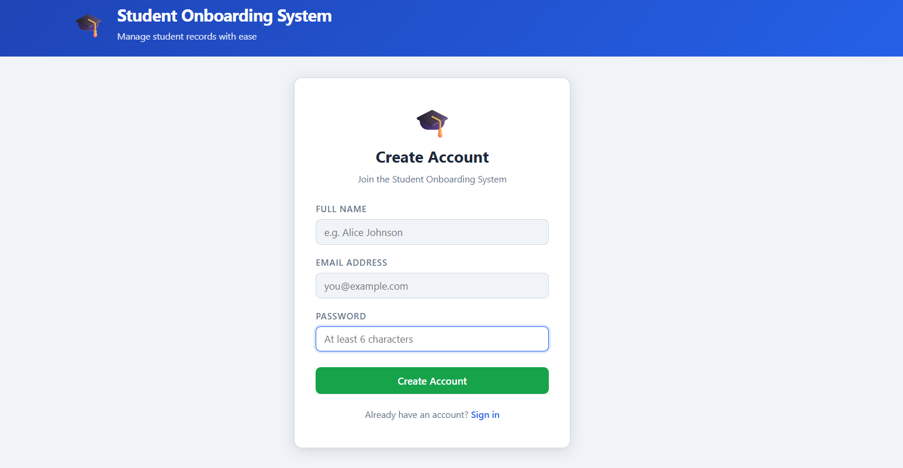
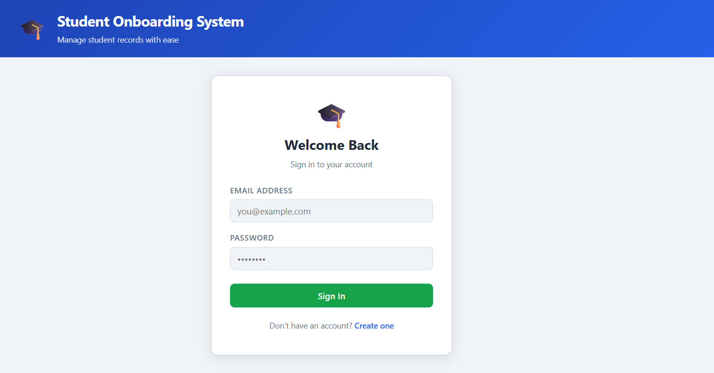

# 🎓 Student Onboarding System

## 📌 Overview
The **Student Onboarding System** is a full-stack application that automates student data generation, validation, storage, and management.

It consists of:
- 🐍 Python Data Pipeline (Service A)
- ☕ Spring Boot Backend API (Service B)
- ⚛️ React Frontend
- 🔐 Authentication Module (Login / Signup)
- 🧪 Test Automation (Selenium + Playwright)
- 🐘 PostgreSQL Database
- 🐳 Docker Containerization (Full System Orchestration)

---

## 🖼️ Project Output

### 📊 System Output

### 🔐 Authentication UI
  

---

## 🚀 End-to-End Workflow

CSV Generation → Data Validation → REST API → Database → UI Display → Authentication → Protected Access

---

## 🧩 Tech Stack

| Layer          | Technology                              |
|----------------|------------------------------------------|
| Data Pipeline  | Python (pandas, requests, watchdog)      |
| Backend        | Spring Boot, JPA, Hibernate              |
| Frontend       | React, React Router                      |
| Auth           | BCrypt (spring-security-crypto)          |
| Testing        | Selenium (Java), Playwright              |
| Database       | PostgreSQL                               |
| DevOps         | Docker, Docker Compose, Nginx            |

---

## 🐍 Service A – Python Pipeline

### Features:
- Generates synthetic student data (with invalid cases)
- Validates data (email, name, age)
- Splits into valid & invalid CSV
- Sends valid data to backend in batches
- Retry logic for API failures

### Key Files:
- `main.py` → Orchestrates pipeline
- `generator.py` → Generates CSV data
- `validator.py` → Validates records
- `sender.py` → Sends data to backend
- `watcher.py` → Monitors directory

---

## ☕ Service B – Spring Boot Backend

### Features:
- REST APIs for CRUD operations
- Bulk insert endpoint
- Pagination support
- Validation using DTOs
- 🔐 Authentication APIs (Signup & Login)
- Password hashing using BCrypt

### APIs:
#### Student APIs:
- `POST /students/bulk` → Bulk insert
- `GET /students` → Paginated fetch
- `PUT /students/{id}` → Update
- `DELETE /students/{id}` → Delete

#### Auth APIs:
- `POST /auth/signup` → Register user
- `POST /auth/login` → Login user

---

## 🔐 Authentication Module

### Features:
- User Signup & Login
- Password hashing using BCrypt
- Duplicate email validation (409 error)
- Invalid credentials handling (401 error)
- Client-side session using `localStorage`
- Protected routes for authenticated users

### Flow:
Signup → Login → Store user in localStorage → Access protected routes → Logout clears session

---

## ⚛️ Frontend – React

### Features:
- View students (table)
- Add / Edit / Delete students
- Pagination support
- Form validation
- API integration
- 🔐 Login & Signup صفحات
- Protected routing
- Logout functionality

### Key Files:
- `App.js` → Routing + ProtectedRoute
- `LoginPage.js` → Login UI
- `SignupPage.js` → Signup UI
- `StudentsPage.js` → Student dashboard
- `authApi.js` → Auth API calls
- `api.js` → Student API calls

---

## 🧪 Test Automation

### 🔹 Selenium (Java)
- UI-based integration testing
- Headless Chrome using WebDriverManager
- Tests:
  - Signup (valid + duplicate)
  - Login (valid + invalid)
  - Logout flow
  - Route protection

### 🔹 Playwright (JavaScript)
- End-to-end testing
- Auto-starts frontend server
- 6 test cases covering:
  - Signup
  - Login
  - Error handling
  - Protected route redirect
  - Logout

---

## 🐘 Database – PostgreSQL

- Tables:
  - `students`
  - `users` (for authentication)

### Fields:
**students**
- `id`, `name`, `email`, `age`

**users**
- `id`, `name`, `email`, `password (hashed)`

---

## 🐳 Docker & Containerization

### Overview
The entire system is containerized using Docker and orchestrated via Docker Compose.

### Services:
- **postgres** → Database container
- **backend** → Spring Boot service
- **python** → Data pipeline (batch execution)
- **frontend** → React app served via Nginx

### Key Features:
- No hardcoded `localhost` (uses Docker service names)
- Environment variable-based configuration
- Nginx reverse proxy for frontend → backend communication
- Health checks and proper startup order
- Fully isolated and scalable architecture

### Architecture Flow:
Postgres → Backend → Python Pipeline  
Backend → Frontend (via Nginx proxy `/api`)

---

## 🌐 Access (Docker)

- Frontend: http://localhost:3000  
- Backend API: http://localhost:8080  
- Auth APIs: http://localhost:8080/auth  

---

## ✅ Key Highlights

- Automated data pipeline with validation
- Batch processing with retry logic
- Scalable REST API with pagination
- Full CRUD operations
- 🔐 Secure authentication system
- 🧪 Automated UI & E2E testing
- Protected frontend routes
- Docker-based microservices architecture
- End-to-end system integration

---

## 🎯 Conclusion

This project simulates a real-world onboarding system combining:

- Data Engineering
- Backend Development
- Frontend UI
- Authentication Systems
- Test Automation
- Database Integration
- DevOps (Docker & Containerization)

It demonstrates strong full-stack development, testing, and system design skills.
